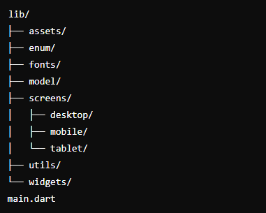

<h1 align="center">Semana Acadêmica 2024</h1>  

    Este projeto tem como objetivo criar um site informativo para a Semana Acadêmica do curso de Sistemas de Informação em 2024. Desenvolvido utilizando a linguagem Dart, o projeto é uma aplicação web construída com Flutter.


## Requisitos

- Flutter SDK >= 3.22.2
- Dart >= 3.4.3

## Etapas para rodar o projeto

```sh
git clone https://github.com/semanasi-dev/web-2024.git

flutter pub get

flutter run -d chrome
```

## Estrutura do projeto



`assets`
Contém arquivos estáticos utilizados no projeto, como imagens, ícones e outros recursos que não são gerados dinamicamente. Esses arquivos são acessados diretamente pelo código Flutter e são incluídos no pacote do site.

`enum`
Contém definições de enumerações utilizadas em todo o projeto. Enumeradores são tipos de dados que consistem em um conjunto de constantes nomeadas, facilitando a organização e o controle de estados e opções.

`font`
Armazena fontes personalizadas utilizadas no projeto. Esse diretório permite que você defina e aplique fontes específicas para garantir a consistência tipográfica do site.

`model`
Define os objetos e estruturas de dados utilizados pela aplicação.

`screens`
Contém as telas e páginas do site. Este diretório está subdividido em pastas para diferentes tipos de dispositivos, garantindo uma experiência responsiva e adaptada a diferentes tamanhos de tela:

`desktop`: Contém as telas otimizadas para dispositivos desktop. Geralmente, essas telas aproveitam o espaço maior da tela para exibir mais informações ou layouts mais complexos.
`mobile`: Contém as telas otimizadas para dispositivos móveis, como smartphones. Essas telas são projetadas para serem compactas e fáceis de navegar em dispositivos com telas menores.
`tablets`: Contém uma tela padrão que exibe um aviso informando que o site não é otimizado para tablets.

`utils`
Contém funções e utilitários auxiliares que ajudam a realizar tarefas comuns ou complexas em todo o projeto.

`widgets`
Armazena widgets personalizados e reutilizáveis que podem ser utilizados em diferentes partes do site. Esses widgets são componentes da interface do usuário que encapsulam a lógica e o estilo, promovendo a reutilização e a modularidade.

## Diretrizes para quem deseja contribuir com o projeto.

- Realize um fork do repositório. 

- Crie um branch para suas alterações:
    
        git checkout -b minha-nova-feature

- Faça as modificações necessárias no código.

- Commit suas alterações:
    
        git commit -m 'feat: Adicionar nova feature'

- Envie para o branch original:

        git push origin minha-nova-feature

- Abra uma Pull Request.

    Seu código será revisado e, se estiver de acordo com os objetivos do projeto, será aceito e mesclado no branch principal (main).


